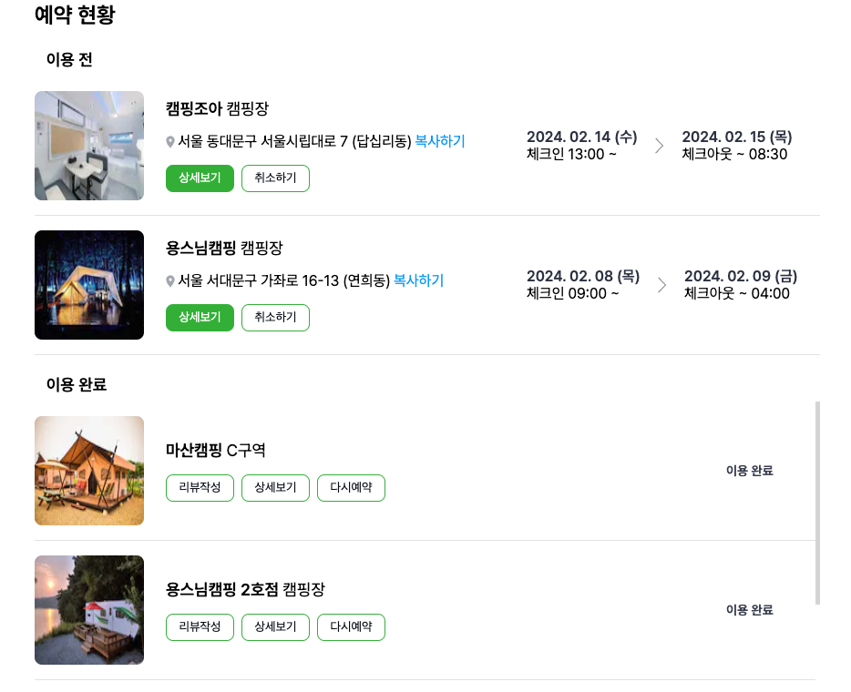

 

 <b>🏕️ 캠퍼스팟 </b>
> 캠핑장 예약 및 검색, 캠핑장 운영, 커뮤니티 플랫폼 '캠퍼스팟'

1️⃣ 캠핑장 검색 및 예약을 할 수 있습니다.
2️⃣ 캠핑장 운영 및 관리, 예약관리를 할 수 있습니다.
3️⃣ 커뮤니티를 통해 캠핑러들과 소통할 수 있습니다.

| 팀원 |  Github  |
|:-----|:--------:|
| 임홍원   | https://github.com/h0ngwon |
| 박유나   | https://github.com/daeppang119 |
| 전민석   | https://github.com/Minseok1228 |
| 정유진   | https://github.com/Yujin-Jeong-dev |
| 조미래   | https://github.com/mirae-Jo |
| 신민정   | 디자이너 |

<h1>기술 스택</h1>
<h3>Language</h3>

<h3>Framework</h3>

<h3>Library</h3>
 
<a href='https://github.com/pmndrs/zustand'>Zustand</a> 
<a href='https://react-hook-form.com/'>react-hook-form</a> 
<a href='https://react-slick.neostack.com/'>react-slick</a> 
<a href='https://www.npmjs.com/package/react-datepicker'>react-datepicker</a> 
<a href='https://fkhadra.github.io/react-toastify/introduction/'>react-toastify</a> 

<h3>Authentication</h3>
<a href='https://next-auth.js.org/'>NexAuth.js</a> 
<h3>BaaS</h3>

<h1>주요 기능</h1>
<h2>검색</h2>

<h2>예약</h2>

<h2>커뮤니티</h2>

<h2>캠핑장 운영</h2>

<h1>기술적 의사결정</h1>
<h2>Next.js</h2>

라우팅을 중심으로 설계하여 러닝 커브는 존재하지만 개발을 효율적으로 할 수 있으며 SEO에 강점이 있고, 서버리스 함수로 별도의 API 서버 없이 API를 구성할 수 있는 강점이 있어서 Next.js App router를 선택하였습니다.

<h2>NextAuth.js</h2>

간편하게 로그인과 회원가입을 구현 할 수 있으며, 세션과 JWT 토큰 또한 쉽게 사용 가능하고 국내 사용자가 많은 카카오와 네이버 OAuth를 제공하는 NextAuth를 선택하였습니다.

<h2>React Query</h2>

데이터를 다루는 비동기처리는 redux thunk를 사용할 수 도 있지만 최적화가 어렵고 보일러플레이트가 많아 react query를 선택했습니다.

<h2>React Hook Form</h2>

클라이언트 상태관리를 전역적으로 할 수 있으며 다른 상태관리 라이브러리보다 러닝커브가 적고 간편하게 사용가능한 Zustand를 선택했습니다.

<h2>Supabase</h2>

Join해야할 데이터가 많고, Cascade가 필요하며 관계형 데이터 베이스를 클라이언트에서 간편하게 사용 가능한 Supabase를 선택했습니다.

<h2>React Slick</h2>

시간적 제약으로 라이브러리를 사용하기로 함, swiper가 react-slick에 비해 2배 가까운 다운로드 수를 가지지만 react-slick 만으로 원하는 기능 구현이 가능했고 unpacked Size가 swiper에 비해 굉장히 작았습니다.
